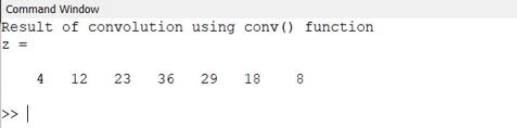
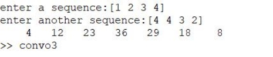
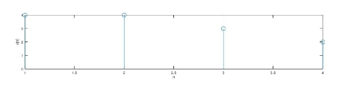
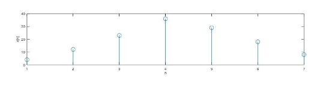

***Heaven’s Light is Our Guide***

**Rajshahi University of Engineering & Technology**

**Department of Electrical & Computer Engineering**

**Course No: ECE 4124**

**Course Title: Digital Signal Processing Sessional**

**Experiment Date:19/03/23**

**Submission Date: 03/05/2023**

<table><tr><th colspan="1" rowspan="2" valign="bottom"><b>Submitted By</b>,</th><th colspan="1" valign="bottom"><b>Submitted To</b>,</th></tr>
<tr><td colspan="1" rowspan="2" valign="bottom">Hafsa Binte Kibria</td></tr>
<tr><td colspan="1" rowspan="2" valign="bottom">Sajeeb Biswas</td></tr>
<tr><td colspan="1" rowspan="2" valign="bottom">Lecturer,</td></tr>
<tr><td colspan="1" rowspan="2" valign="bottom">ID: 1810025</td></tr>
<tr><td colspan="1" rowspan="2" valign="bottom">Department of Electrical & Computer</td></tr>
<tr><td colspan="1" rowspan="2" valign="bottom">Department of Electrical & Computer</td></tr>
<tr><td colspan="1" rowspan="2" valign="bottom">Engineering (ECE)</td></tr>
<tr><td colspan="1" rowspan="2" valign="bottom">Engineering (ECE)</td></tr>
<tr><td colspan="1" rowspan="2" valign="bottom">RUET</td></tr>
<tr><td colspan="1" rowspan="2" valign="bottom">RUET</td></tr>
<tr><td colspan="1" valign="bottom"></td></tr>
</table>

**Experiment No: 01**

**Experiment Name:** Study of linear convolution and implementation using

MATLAB

**Theory:**

Convolution is a formal mathematical operation, just as multiplication, addition, and integration. Addition takes two numbers and produces a third number, while convolution takes two signals and produces a third signal. Convolution is used in the mathematics of many fields, such as probability and statistics. In linear systems, convolution is used to describe the relationship between three signals of interest: the input signal, the impulse response, and the output signal.

Consider two signals x(n) and h(n). Then, the convolution of these two signals is defined as-

( )=∑	( )∗ℎ( )

k=-

**Used Platform**: MATLAB

**Code:**	With conv function

1. clc;

1. clear all;
1. close all;
1. y1 = [ **1**, **2**, **3**, **4**];
1. h1 = [**4**, **4**, **3**, **2**];
1. l1 = length(y1);
1. l2 = length(h1);
1. l = l1+l2-**1**;
1. z = zeros(**1**, l);
1. z = conv(y1, h1);

1. display('convolution using conv() function');
1. display(z);

**Output:**

Without conv function:

x= input('enter a sequence:');

h= input('enter another sequence:');

a= length(x);

b= length(h);

n=a+b-**1**;

y=zeros(**1**,n);

l=**1**:n;

X=[x,zeros(**1**,b)];

H=[h,zeros(**1**,a)];

**for** i=**1**:a+b-**1**

y(i)=**0**;

**for** j=**1**:a

**if**(i-j+**1**>**0**)

y(i)=y(i)+X(j)\*H(i-j+**1**);

**else**

end

end

end

**disp**(y)

subplot(**3**,**1**,**1**);

stem(l,y);

xlabel('n');

ylabel('x[n]');

**Output:**

**Curve:**

Figure 1.1: Graphical representation of the output of using conv() function

Figure 1.2: Graphical representation of the output of without using conv() function

**Discussion & Conclusion:**

Here basically linear convolution was implemented firstly using ‘conv’ function then without ‘conv’ function.

Without utilizing MATLB's built-in conv() method, the experiment was about to create convolution. After having some issues with the loop conditions it was successfully developed using a for loop and mathematical reasoning.
