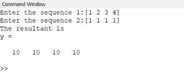
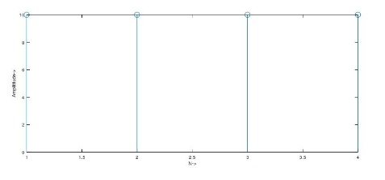
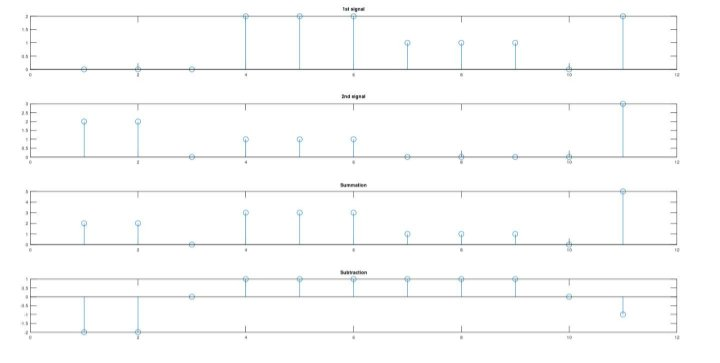
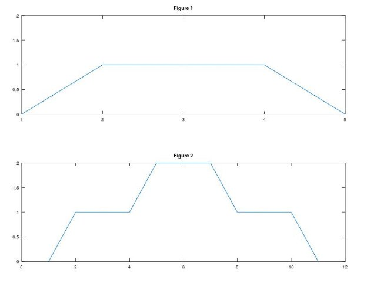
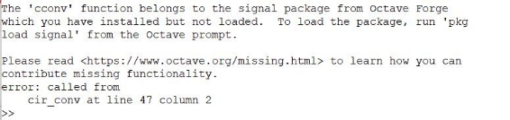



Heaven’s Light is Our Guide

Rajshahi University of Engineering & Technology

**Department of Electrical & Computer Engineering**

**Course No: ECE 4124**

**Course Title: Digital Signal Processing Sessional**

**Experiment Date:03/05/23**

**Submission Date: 08/05/23**

<table><tr><th colspan="1" rowspan="2" valign="bottom"><b>Submitted By</b>,</th><th colspan="1" valign="bottom"><b>Submitted To</b>,</th></tr>
<tr><td colspan="1" rowspan="2" valign="bottom">Hafsa Binte Kibria</td></tr>
<tr><td colspan="1" rowspan="2" valign="bottom">Sajeeb Biswas</td></tr>
<tr><td colspan="1" rowspan="2" valign="bottom">Lecturer,</td></tr>
<tr><td colspan="1" rowspan="2" valign="bottom">ID: 1810025</td></tr>
<tr><td colspan="1" rowspan="2" valign="bottom">Department of Electrical & Computer</td></tr>
<tr><td colspan="1" rowspan="2" valign="bottom">Department of Electrical & Computer</td></tr>
<tr><td colspan="1" rowspan="2" valign="bottom">Engineering (ECE)</td></tr>
<tr><td colspan="1" rowspan="2" valign="bottom">Engineering (ECE)</td></tr>
<tr><td colspan="1" rowspan="2" valign="bottom">RUET</td></tr>
<tr><td colspan="1" rowspan="2" valign="bottom">RUET</td></tr>
<tr><td colspan="1" valign="bottom"></td></tr>
</table>

**Experiment No: 02**

**Experiment Name:**

1. **Take two signals and show the circular convolution of the signals.**
1. **N1 ={ 0,0,0,2,2,2,1,1,1,0,2}**

**N2 ={ 2,2,0,1,1,1,0,0,0,0,3}**

**Plot the figure of the two signals & also plot the summation & subtraction of the two signals.**

1. **Draw the following signals in one figure,**

**Theory:**

Circular convolution is a technique used in Digital Signal Processing (DSP) to combine two finite-length sequences in a way that is beneficial for a variety of applications. It is described as the periodic convolution of two sequences, where the final sequence is also of finite length and is produced by encircling the edges of the input sequences with the convolution sum.

The circular convolution of two sequences of length N, x(n) and h(n), is denoted mathematically by:

y(n) = [x(k) \* h((n-k) mod N)] \* (1/N) , k=0 to N-1

where "mod" stands for the modulo operator, which makes sure the index (n-k) stays between 0 and N-1. A series of length N that is periodic with a period of N is produced by the circular convolution.

**Used Platform**: MATLAB

**Code for Problem 1:**

clc;

x=input('Enter the sequence **1**:');

h=input('Enter the sequence **2**:');

N1=length(x);

N2=length(h);

N=max(N1,N2);

N3=N1-N2;

**if**(N3>**0**)

h=[h,zeros(**1**,N3)];

**else**

x=[x,zeros(**1**,-N3)];

end

**for** n=**1**:N;

y(n)=**0**;

**for** i=**1**:N;

j=n-i+**1**;

**if**(j<=**0**)

j=N+j;

end

y(n)=[y(n)+(x(i)\*h(j))];

end

end

**disp**('The resultant is');y

**subplot**(**2**,**1**,**1**);

stem(y);

xlabel('N->');

ylabel('Amplititude->');

**Output:**

**Curve for Problem 1:**

Figure 2.1: Graphical representation of the output of circular convolution

**Code for Problem 2:**

clc;

clear all;

n1=[**0**,**0**,**0**,**2**,**2**,**2**,**1**,**1**,**1**,**0**,**2**];

n2=[**2**,**2**,**0**,**1**,**1**,**1**,**0**,**0**,**0**,**0**,**3**];

n3= n1+n2;

n4=n1-n2;

subplot(**4**,**1**,**1**)

stem(n1);

title('**1**st signal');

subplot(**4**,**1**,**2**)

stem(n2);

title('**2**nd signal');

subplot(**4**,**1**,**3**)

stem(n3);

title('Summation');

subplot(**4**,**1**,**4**)

stem(n4);

title('Subtraction');

**Output:**

Figure 2.2: Graphical representation of the output of problem 2

**Code for Problem 3:**

clc;

clear all;

close all;

t= **0**:**1**:**4**;

t1= **0**:**1**:**10**;

x=[**0 1 1 1 0**];

subplot(**2**,**1**,**1**);

plot(x);

title('Figure **1**');

axis([**1 5 0 2**]);

h=[**0 1 1 1 2 2 2 1 1 1 0**];

subplot(**2**,**1**,**2**);

plot(h);

title('Figure **2**');

axis([**1 8 8 0 3**]);

**Output:**

Figure 2.3: Graphical representation of the output of problem 3

**Discussion & Conclusion:**

There were mainly 3 experiment that we had to complete in that lab. The first one was circular convolution of two signals, mainly here I personally faced some problem. The required result couldn’t find and I think there was some technical issues associated with my matlab software version. The below message was shown whenever the program was run,

But finally the problem was solved and the required output was got. The rest of the experiment was done successfully without any error.
