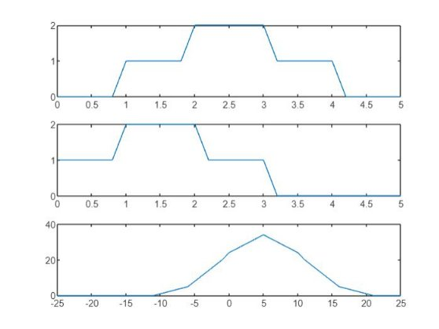

***Heaven’s Light is Our Guide***

**Rajshahi University of Engineering & Technology**

`      `**Department of Electrical & Computer Engineering**

**Course No: ECE 4124**

**Course Title: Digital Signal Processing Sessional**

**Experiment Date:15/05/23**

**Submission Date: 22/05/23**

**Submitted To**,

Hafsa Binte Kibria

Lecturer, 

Department of Electrical & Computer Engineering (ECE)

RUET

**Submitted By**,

Sajeeb Biswas

ID: 1810025

Department of Electrical & Computer Engineering (ECE)

RUET

**Experiment No: 04**

**Experiment Name:**  Study of Identifying Signal Delays using Cross Correlation

**Theory:**

Cross-correlation can indeed be used to identify signal delays. Cross-correlation measures the similarity between two signals as a function of the time lag between them.

To identify signal delays using cross-correlation, you need to perform the following steps:

1. Choose the two signals you want to compare: the reference signal and the delayed signal.

1. Calculate the cross-correlation between the two signals using a cross-correlation function or method. This involves sliding one signal over the other and computing the similarity at each time lag.

1. Find the time lag that corresponds to the highest correlation value or peak in the cross-correlation function. This lag indicates the delay between the two signals.

By determining the delay between the reference signal and the delayed signal, you can gain insights into the time difference or synchronization issues that may exist between them.

**Used Software: MATLAB**

**Code:**

clear all

close all

clc

fs=**5**;

t=**0**:**1**/fs:**5**;

s1=t>=**1**&t<=**4**;

s2=t>=**2** & t<=**3**;

s=s1+s2;

d1=t>=**0** & t<=**3**;

d2=t>=**1** & t<=**2**;

d=d1+d2;

Maxlength=length(t)-**1**;

A=-Maxlength:Maxlength;

C=xcorr(s,d);

subplot(**3**,**1**,**1**);

plot(t,s)

subplot(**3**,**1**,**2**);

plot(t,d)

subplot(**3**,**1**,**3**);

plot(A,C)

**Output:**

**Figure:** Finding Delay Using Cross Correlation

**Discussion & Conclusion:**

In this lab, we demonstrated how to use MATLAB to do cross correlation. The MATLAB result and the analytical solution to the identifying delay were also examined, and a very close agreement was discovered. This displays how well MATLAB works for carrying out mathematical procedures like correlation.

